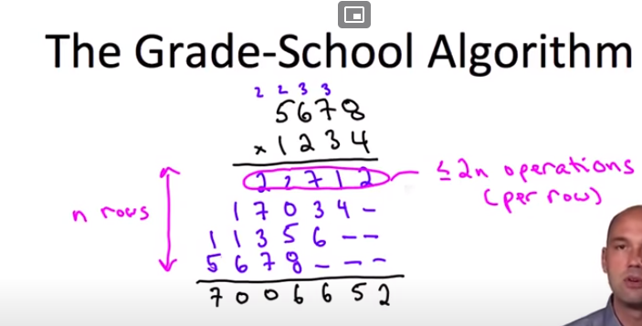

At grade school, this is common way to multiply 2 numbers. Here is $1234 \times 5678$. 2 numbers multiply each other with the way we were been taught. 
The way to get the output is by
- the digit 4, multiply 5, 6, 7, 8 respectively. It's 1 operation
- add up all the products. at tenth, $1 + 4 = 5$, and then hundredth $7 + 3 + 6 = 16$ and so on. It's 1 operation.
- We multiply it by $n$ rows.

This gives us $2n^2$. This way is it.

